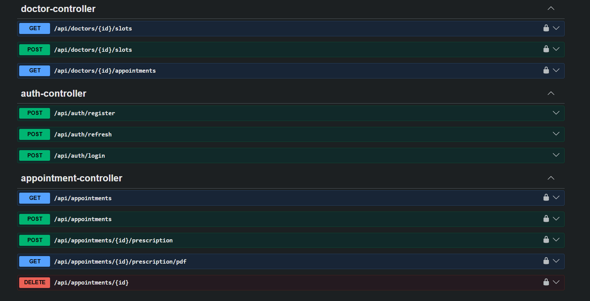

# ClinicApp — Doctor-Patient Appointment & Prescription System

A backend system for small clinics to manage doctor availability, patient bookings,
and digital prescriptions — built to solve the double-booking race condition that
naive appointment systems get wrong.

## Tech Stack
- Java 21, Spring Boot 4.1
- Spring Security + JWT (access + refresh tokens, rotation, hashed storage)
- Spring Data JPA + Hibernate, PostgreSQL
- Flyway (versioned schema migrations)
- OpenPDF (prescription PDF generation)
- springdoc-openapi (Swagger UI)

## The Core Problem: Concurrent Booking
Two patients hitting "book" on the same slot within milliseconds is a classic race
condition. A naive `if (slot.status == AVAILABLE) { book(); }` check can let both
requests pass the check before either writes — resulting in a double-booked slot.

**Solution:** optimistic locking via a `@Version` column on `Slot`. Every booking
update includes `WHERE id = ? AND version = ?` — if two threads race, only the
first commits; the second's `WHERE` clause matches zero rows, Hibernate throws
`ObjectOptimisticLockingFailureException`, which is caught and returned as a clean
`409 Conflict`.

### Proof: Concurrency Test
A JUnit test (`AppointmentConcurrencyTest`) fires 10 simultaneous booking requests
at the same available slot using `ExecutorService` + `CountDownLatch` (to force
genuine thread contention, not staggered starts).

**Result: exactly 1 success, 9 conflicts — every time.**

## Features
- JWT auth with refresh token rotation (stored SHA-256 hashed, single-use)
- Role-based access (DOCTOR / PATIENT) via `@PreAuthorize`
- Ownership checks on every resource (a patient can't cancel/view another
  patient's appointment — ownership verified against the token identity, not
  just role)
- Slot generation, booking, cancellation (all `@Transactional`)
- Prescription creation + PDF download (OpenPDF, in-memory generation)
- Centralized exception handling — every failure mode returns a clean status
  code (401/403/409) instead of a raw stack trace

## API Overview

## Running Locally
1. local Postgres, create a `clinicapp` database
2. Update `application.properties` with DB credentials
3. `mvn spring-boot:run` — Flyway auto-appies all migrations
4. Swagger UI: `http://localhost:8080/swagger-ui/index.html`